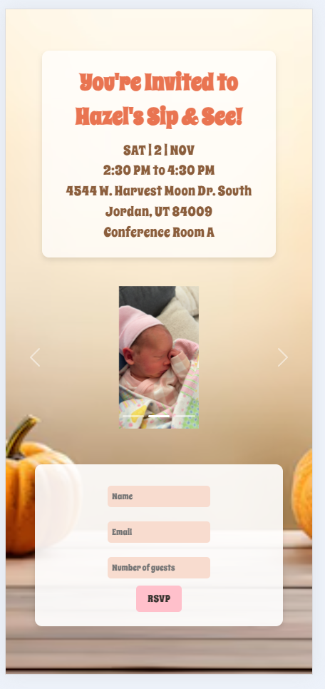
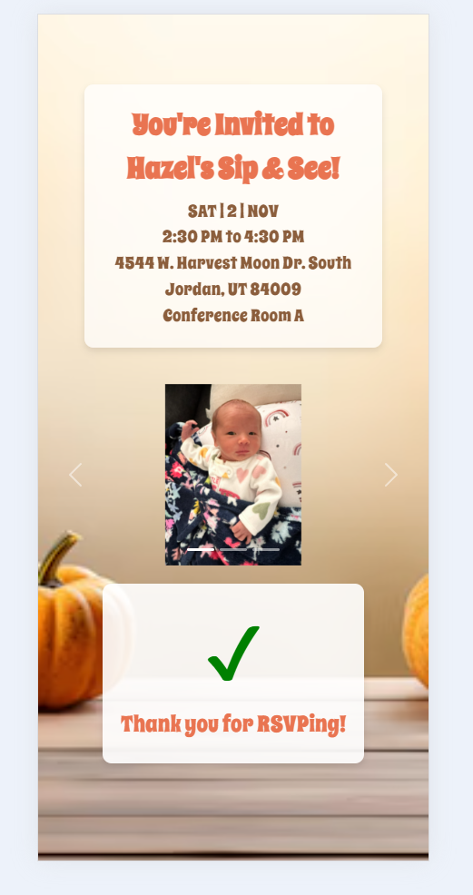
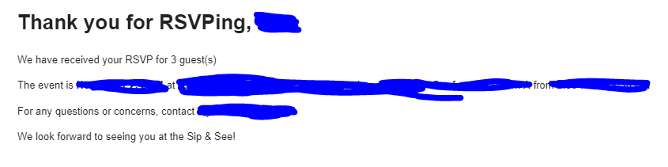

# RSVP Application

## Overview

This is my RSVP application! It is a single page app that allows users to RSVP to an event using their email, name and the amount of guests coming. After clicking the RSVP button, an Email is sent to the user confirming the RSVP and providing a message with information

## Features

- **User Registration**: Users can sign up with their email and name.
- **RSVP Submission**: Users can submit their RSVP, including the number of guests.
- **Email Confirmation**: Users receive a confirmation email with RSVP details.
- **Responsive Design**: The app is designed to be mobile-friendly, ensuring a good experience on all devices.

## Screenshots

### 1. Initial View
This is the first screen users see when they access the application. It prompts them to enter their RSVP details.

### 2. RSVP Confirmation
After submitting their RSVP, users are shown a confirmation message, letting them know their RSVP has been received successfully.

### 3. Email Confirmation
An example of the email that is automatically sent to the user upon successful RSVP submission. This email contains the details of their RSVP.

  
## Technologies Used

- **Frontend**: React, Bootstrap
- **Backend**: Node.js, Express
- **Database**: Supabase
- **Email Sending**: Nodemailer
